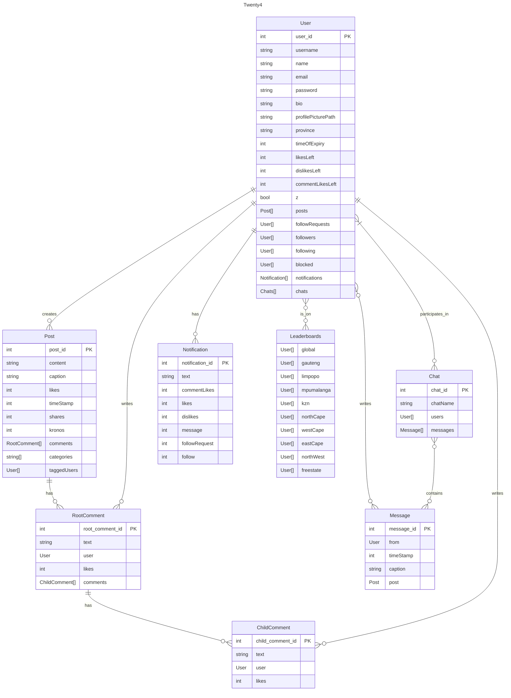

# COS 301 Mini-Project

## Notes

User starts with 336 hours of time when creating account.

### Data Engineer"s Notes

Any field value written as /\*\<tableName>\*/ indicates a reference to the table by the object's _id field.

## Database Planning

#### User

- Username (string)
- Name (string)
- Email (string)
- Password (string)
- Bio (string)
- Profile Picture (string)
- Province (string) Will be in the list {gp, nw, ec, wc, nc, lp, mp, kzn, fs}
- Time of expiry (UNIX timestamp as int)
- Posts (array[Post])
- Followers (array[User])
- Following (array[User])
- Likes Left (int)
- Dislikes Left (int)
- Comments Likes Left (int)
- notPublic (boolean)
- Follow Requests (array[User])
- Blocked Users (array[User])
- Notifications (array[Notification])
- Chats (array[Chat])

```json

"user" : {
    "user_id" : 1,
    "username": "UserName",
    "name": "Name Surname",
    "email": "email@example.com",
    "password": "pa5sW0rd_ha5h", // hashed password
    "bio" : "bio of the user",
    "profilePicturePath" : "C:\\path\to\\image.ext",
    "province" : "province abbreviation",
    "timeOfExpiry": 420, // UNIX time code indicating when the account will expire
    "likesLeft": 10,
    "dislikesLeft" : 10,
    "commentLikesLeft" : 10,
    "notPublic": true, // whether the account is public or private
    "posts": [/*Post*/],
    "followRequests": [/*User*/],
    "followers": [/*User*/],
    "following": [/*User*/],
    "blocked" : [/*User*/],
    "notifications": [/*Notification*/],
	"chats": [/*Chat*/],
}

```

#### Notifications

- Text (string)
- reference ID (int)

##### Types of notifications

- Comment Likes
- Comments
- Likes
- Dislikes
- Message
- Follow Request
- Follows

```json

"notification" : {
    "notification_id" : 1,
    "text" : "Notification text",
    "commentLikes" : 1,
    "comment" : 1,
    "likes" : 1,
    "dislikes" : 1,
    "message" : 1,
    "followRequest" : 1,
    "follow" : 1,
}

```

#### Post

- Content (path to image or video)
- Caption (string)
- Comments (array[RootComment])
- Likes (int)
- TimeStamp (int)
- Kronos (int)
... (349 lines left)
Collapse
data_engineer_notes.md
11 KB

# COS 301 Mini-Project

## Notes

User starts with 336 hours of time when creating account.

### Data Engineer"s Notes

Any field value written as /\*\<tableName>\*/ indicates a reference to the table by the object's _id field.

## Database Planning

#### User

- Username (string)
- Name (string)
- Email (string)
- Password (string)
- Bio (string)
- Profile Picture (string)
- Province (string) Will be in the list {gp, nw, ec, wc, nc, lp, mp, kzn, fs}
- Time of expiry (UNIX timestamp as int)
- Posts (array[Post])
- Followers (array[User])
- Following (array[User])
- Likes Left (int)
- Dislikes Left (int)
- Comments Likes Left (int)
- notPublic (boolean)
- Follow Requests (array[User])
- Blocked Users (array[User])
- Notifications (array[Notification])
- Chats (array[Chat])

```json

"user" : {
    "user_id" : 1,
    "username": "UserName",
    "name": "Name Surname",
    "email": "email@example.com",
    "password": "pa5sW0rd_ha5h", // hashed password
    "bio" : "bio of the user",
    "profilePicturePath" : "C:\\path\to\\image.ext",
    "province" : "province abbreviation",
    "timeOfExpiry": 420, // UNIX time code indicating when the account will expire
    "likesLeft": 10,
    "dislikesLeft" : 10,
    "commentLikesLeft" : 10,
    "notPublic": true, // whether the account is public or private
    "posts": [/*Post*/],
    "followRequests": [/*User*/],
    "followers": [/*User*/],
    "following": [/*User*/],
    "blocked" : [/*User*/],
    "notifications": [/*Notification*/],
	"chats": [/*Chat*/],
}

```

#### Notifications

- Text (string)
- reference ID (int)

##### Types of notifications

- Comment Likes
- Comments
- Likes
- Dislikes
- Message
- Follow Request
- Follows

```json

"notification" : {
    "notification_id" : 1,
    "text" : "Notification text",
    "commentLikes" : 1,
    "comment" : 1,
    "likes" : 1,
    "dislikes" : 1,
    "message" : 1,
    "followRequest" : 1,
    "follow" : 1,
}

```

#### Post

- Content (path to image or video)
- Caption (string)
- Comments (array[RootComment])
- Likes (int)
- TimeStamp (int)
- Kronos (int)
- Categories (array["string"])
- Tagged Users (array[User])
- Share Count (int)

```json

"post" : {
    "post_id": 1,
    "content" : "C:\\path\to\\imageOrVideo.ext",
    ext", // only one of these fields will be displayed.
    "caption": "Caption of the post",
    "likes": 0,
    "timeStamp": 1234567890,
    "shares" : 0,
    "kronos" : 0,
    "comments": [/*RootComment*/],
    "categories": [/*String*/], // Max 3
    "taggedUsers" : [/*User*/]
}

```

#### RootComment

- Kronos (int)
- Text (string)
- User (User)
- Likes (int)
- ChildComments (array[ChildComment])

```json

"rootComment" : {
    "root_comment_id": 1,
    "kronos" : 0,
    "text": "Comment",
    "user": /*User*/,
    "likes": 0,
    "comments": [/*ChildComment*/],
}

```

#### ChildComment

- Kronos (int)
- Text (string)
- User (User)
- Likes (int)

```json

"childComment" : {
    "child_comment_id": 1,
    "kronos" : 0,
    "text": "Comment",
    "user": /*User*/,
    "likes": 0,
}
```

#### Direct Messages

```json

"chats" : [
    {
        "chat_id": 3523,
        "chatName": "Name of the Chat",
        "users" : [/*User*/],
        "messages" : [
            {
                "message_id": 235233,
                "from" : /*User*/,
                "timeStamp" : 129348768213,
                // caption and post are optional, but at least one is always necessary.
                "caption" : "I love you <3",
                "post" : /*Post*/,
            }
        ],
    }
]

```

#### Local Leaderboard

Top 24. Updated every X hours. The top ten are then saved in the "localLeaderboard" array.

There will exist one for each province and one for the global leaderboard.

```json
"leaderboards" : {
    "gauteng" : [/*User*/],
    "limpopo" : [/*User*/],
    "mpumulanga" : [/*User*/],
    "kzn" : [/*User*/],
    "northWest" : [/*User*/],
    "westCape" : [/*User*/],
    "eastCap" : [/*User*/],
    "northCape" : [/*User*/],
    "freestate" : [/*User*/],
    "global" : [/*User*/],
}
```

#### Example

```json
{
    "users" : [
        {
            "user_id" : 10398140,
            "username": "DieSeeKat",
            "name": "Lukas Anthonissen",
            "email": "lukas007@gmail.com",
            "password":   "ynw8yw82n283c2doNdq6T*&nqn",
            "bio" : "live love life",
            "profilePicturePath" : "C:\\images\\gigachad.jpg",
            "province" : "gp",
            "timeOfExpiry": 33235271617,
            "likes": 10,
            "dislikes": 5,
            "commentLikes" : 7,
            "notPublic" : true,
            "posts": [{
                "post_id": 69,
                "content": "C:\\images\\dodgeCoinMeme.jpg",
                "caption": "Crypto go brrrrrr",
                "likes": 10731827,
                "shares" : 1,
                "timeStamp" : 2938729834,
                "comments": [
                {
                    "root_comment_id" : 3424,
                    "text": "so funny ROFLMAOCOL",
                    "user": 8971892,
                    "likes": 234,
                    "comments": [
                        {
                            "child_comment_id": 879853,
                            "text": "ik right?",
                            "user": 10398140,
                            "likes": 12
                        }
                    ]
                }
            ],
            "categories": ["memes","crypto"], 
            "taggedUsers" : [8971892]
            }],
            "followers": [8971892],
            "following": [8971892],
            "followRequests": []
        },
        {
            "user_id" : 8971892,
            "username": "RuRu",
            "name": "Ruan Rossouw",
            "email": "ruanRos@gmail.com",
            "password": "ynw8yw82n283c2doNdq6T*&nqn",
            "bio" : "UP student",
            "profilePicturePath" : "C:\\images\\superchad.pdf",
            "province" : "gp",
            "timeOfExpiry": 1678362817,
            "likes": 6,
            "dislikes": 10,
            "commentLikes" : 2,
            "notPublic" : true,
            "posts": [],
            "followers": [10398140],
            "following": [10398140],
            "followRequests": []
        }
    ],

    "chats" : [
        {
            "chat_id":235232,
            "chatName": "Demons",
            "users" : [10398140, 8971892],
            "messages" : [
                {
                    "message_id" : 24987,
                    "from" : 10398140,
                    "timeStamp" : 129348768213,
                    "caption" : "I'm going to play LoL at 8, wanna join?"
                },
                {
                    "message_id" : 24988,
                    "from" : 8971892,
                    "timeStamp" : 129348234233,
                    "caption" : "Sure! I'll probably hop on at about half 9"
                },
                {
                    "message_id" : 24989,
                    "from" : 8971892,
                    "timeStamp" : 129348233523,
                    "post" : 69
                },
                {
                    "message_id" : 24990,
                    "from" : 8971892,
                    "timeStamp" : 129348238974,
                    "caption" : "BTW this post is hillarious!!!"
                },
                {
                    "message_id" : 24991,
                    "from" : 10398140,
                    "timeStamp" : 129348664871,
                    "caption" : "sus"
                }
            ]
        }
    ],

    "leaderboards" : {
        "global" : [10398140, 8971892],
        "gauteng" : [10398140, 8971892],
        "limpopo" : [],
        "mpumalanga" : [],
        "kzn" : [],
        "northWest" : [],
        "westCape" : [],
        "eastCap" : [],
        "northCape" : [],
        "freestate" : []
    }
}

```

# UML Diagram

<div align="center">



</div>
